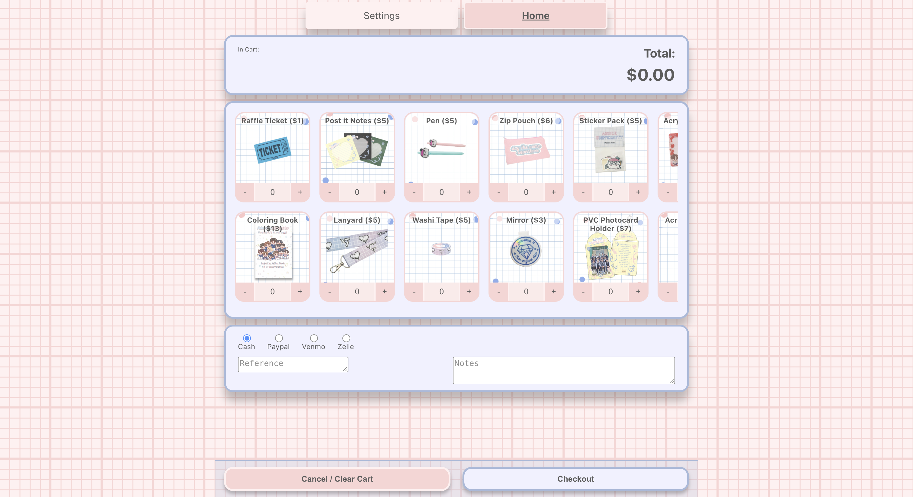
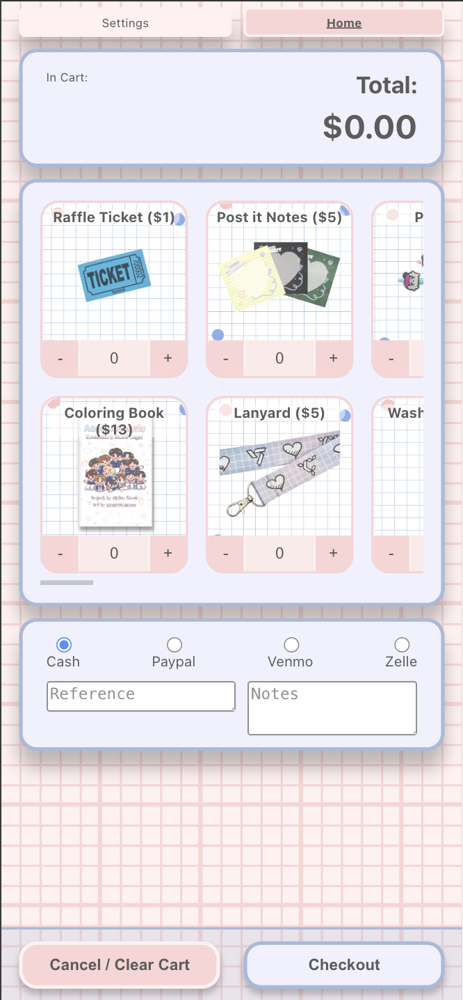

# Potion Stock Manager

A little point-of-sale / inventory app for a friend who sells Seventeen themed merch at conventions. "Potion" is just a random word I picked to mean "inventory" — there are no actual potions involved, it's lanyards and photocard holders and washi tape.

The whole thing is a React frontend that talks straight to the **Google Sheets API**. You log in with Google, tell it which sheet to use, and every checkout gets appended as a new row.

## Why Google Sheets instead of a real backend?

My friend was already tracking sales in a Google Sheet — that was their workflow. We had a convention coming up mid-week and not much time, so instead of standing up a backend and migrating them off of something that already worked, I just wrote the sales straight into their existing sheet. They keep their spreadsheet, we get a nice tappable form, and it was ready in time. Seamless beats clever.

## What it looks like

Desktop:



Mobile (it's meant to be used on a phone at the table):



## How it works

1. **Sign in with Google.** Required — the app asks for the `spreadsheets` scope so it can write on your behalf. Nothing happens without a logged-in Google account.
2. **Enter your sheet.** In Settings you punch in the Google Sheets ID and the tab/sheet name you want rows appended to.
3. **Ring people up.** Tap `+` / `-` on each item to build a cart, pick a payment method (Cash / Paypal / Venmo / Zelle), optionally add a reference + notes, and hit **Checkout**.
4. **Row gets written.** Each checkout appends a row to your sheet: timestamp, reference, per-item totals + quantities, payment method, grand total, and notes.

The item catalog lives in [`src/constants/inventory.json`](src/constants/inventory.json) and the product images are in `public/images`. Your sheet ID, token, and in-progress cart are stashed in `localStorage`, so a refresh mid-convention won't wipe the cart.

## Running it locally

It's a Create React App project.

```bash
npm install
npm start      # dev server at http://localhost:3000
npm run build  # production build
```

Heads up: the Google OAuth client ID is hardcoded in [`src/index.js`](src/index.js). If you fork this, swap in your own client ID from the Google Cloud console (and make sure your origin is on the authorized list).

It's deployed to GitHub Pages at the `homepage` in `package.json`.

## Tech

- React 18 + React Router
- `@react-oauth/google` for the Google login
- Google Sheets API v4 (`values:append`) as the "database"
- Sass modules for styling

## Notes / caveats

- This was built fast for a specific event, so it's tailored to one seller's catalog and sheet layout. Editing the items means editing `inventory.json`.
- Because it writes directly from the browser, whoever's signed in needs edit access to the sheet.
